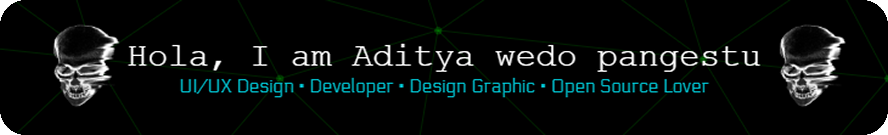

<!-- Header / Hero -->

### 🔭 About Me

I am a Mobile Application and Technology student at Binus University, focusing on mobile application development with an emphasis on frontend and UI/UX design. I enjoy creating simple yet functional interfaces using Figma, developing Android frontends with Kotlin, and I also have some skills in backend development, though not at a professional level.

---

### 🧰 Tech & Tools

---

### 📚 I’m currently learning:

- **SwiftUI** → for iOS development
- **Laravel** → for backend web development

<picture>
  <source media="(prefers-color-scheme: dark)" srcset="https://raw.githubusercontent.com/AdityaWedo30/AdityaWedo30/output/pacman-contribution-graph-dark.svg">
  <source media="(prefers-color-scheme: light)" srcset="https://raw.githubusercontent.com/AdityaWedo30/AdityaWedo30/output/pacman-contribution-graph.svg">
  
